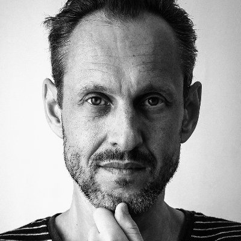

# Hennadii Stepanov

Hennadii has been contributing to Bitcoin Core since 2018 and became
the project's GUI maintainer in 2021.  Brink began funding him in 2021
and helped relocate him and his family from Ukraine to the United
Kingdom in 2022.  During 2023, he left almost 1,300 review comments and
helped spearhead the initiative to modernize Bitcoin Core's build system
from autotools to CMake.  He also works closely with the Bitcoin Design
community in the creation of a QML-based reference GUI that's compatible
with Bitcoin Core and demonstrates user-interface best practices.

On behalf or our sponsors, Brink is pleased to be able to continue
funding Hennadii's work on both the high-level GUI and various low-level
systems.

## Reviews

> As a code reviewer, I was mostly focused on the following topics: the
> build system (including depends and Guix), CI tests, the
> libbitcoinkernel project, and the GUI.

Nearly every review from Hennadii starts with him actually running the
code, something other reviewers sometimes skip but which occasionally
reveals bugs that are obvious to a human but hidden from the automated
testing infrastructure.  This is especially useful when testing GUI
changes and changes to the build system, which are difficult to
completely automatically test.

## GUI maintainer

> As a maintainer, I was responsible for: [Bitcoin Core GUI
> repository][], [Bitcoin Core translation][] project on Transifex,
> Translations-related steps in the release process for every release,
> and [Bitcoin Core QML GUI repository][].

The Bitcoin Core project has [experimented][monotree] with the
_monotree_ development model used by the Linux Kernel project.  The
Bitcoin Core GUI repository is maintained separately from the project's
main repository.  Periodically, Hennadii pulls changes from the main
repository into the QML GUI repository.  This allows developers focused on GUI development to
subscribe to the GUI repository and ignore changes to the main
repository, or vice versa for developers interested in the main project
but not the GUI.

In addition to performing these periodic syncs, Hennadii is responsible
for triaging all new issues and pull requests to the GUI repository, and
he often ends up not just triaging new issues but also fixing them.

As the only one of Bitcoin Core's maintainers that isn't a native
speaker of English, he also generously agreed
several years ago to manage the translation process that allows Bitcoin
Core to be available in dozens of languages.

Bitcoin Core's current Qt-based GUI is a 12 year old <!-- since commit
f7f2a36925bb560363f691fc3ca3dec83830dd15 --> re-implementation of the
original wxWindows GUI used in Bitcoin 0.1.  It's been upgraded many
times to support new features, but Hennadii and several members of the
[Bitcoin Design][] community have been working a new version based on
the QML design language.  The goal is not only to upgrade Bitcoin Core's
GUI but also to offer a reference design for other Bitcoin software
that provides a wallet and can operate a node.

## CMake

> The CMake reviewing process is still happening in a dedicated staging
> branch with an extensive set of CI tests. Its current progress is
> approximately 85% (57 reviewed commits, 80 reviewed pull requests) for
> now. The collaboration involves seven active reviewers: Cory Fields,
> Sebastian Kung, Michael Ford, Vasil Dimov, Aaron Clauson, Max Edwards,
> and Pablo Martin [and Hennadii makes eight]. We have weekly Google
> Meet calls.

Hennadii has been working with multiple other contributors on a long-term
project to convert Bitcoin Core from GNU autotools to the modern CMake
build system.  This will not only significantly simplify the build
system, it will also unlock additional benefits, such as the ability to
upgrade Bitcoin Core's GUI to the latest version of Qt, the
cross-platform widget library it uses.

In addition to his work directly on the Bitcoin Core side of the build
system, Hennadii also contributed CMake code to the libsecp256k1
project, which allowed it to immediately access some of the improvements
available with CMake and will simplify integrating it with a CMake
version of Bitcoin Core in the future.

## Plans for 2024

> This next year I plan to work on migration to the CMake-based build
> system; reviewing pull requests that interest me, namely: build
> system, libbitcoinkernel, cluster-based mempool (linearization and
> feerate diagrams); getting rid of Boost.Process and re-enabling
> external signer support on Windows; hardware-accelerated SHA256
> implementations for native Windows builds; and removing recursive
> mutexes from the codebase.

Improvements to the build system will continue allowing Bitcoin Core to
run on a variety of platforms, ensuring that almost anyone running any
variety of modern hardware and operating system will continue to be able
to run a full node.  In particular, Hennadii is one of the Bitcoin
Core developers most focused on ensuring Bitcoin Core remains fully
functional on Windows, a platform with a large number of less-technical
users who still want to use Bitcoin without needing to trust any third
party and who can still contribute to enforcing Bitcoin's consensus
rules by validating their own transactions with their own node.

[bitcoin core gui repository]: https://github.com/bitcoin-core/gui
[bitcoin core translation]: https://explore.transifex.com/bitcoin/bitcoin/
[bitcoin core qml gui repository]: https://github.com/bitcoin-core/gui-qml
[monotree]: https://bitcoinops.org/en/newsletters/2020/06/24/#bitcoin-core-19071
[bitcoin design]: https://bitcoin.design/
