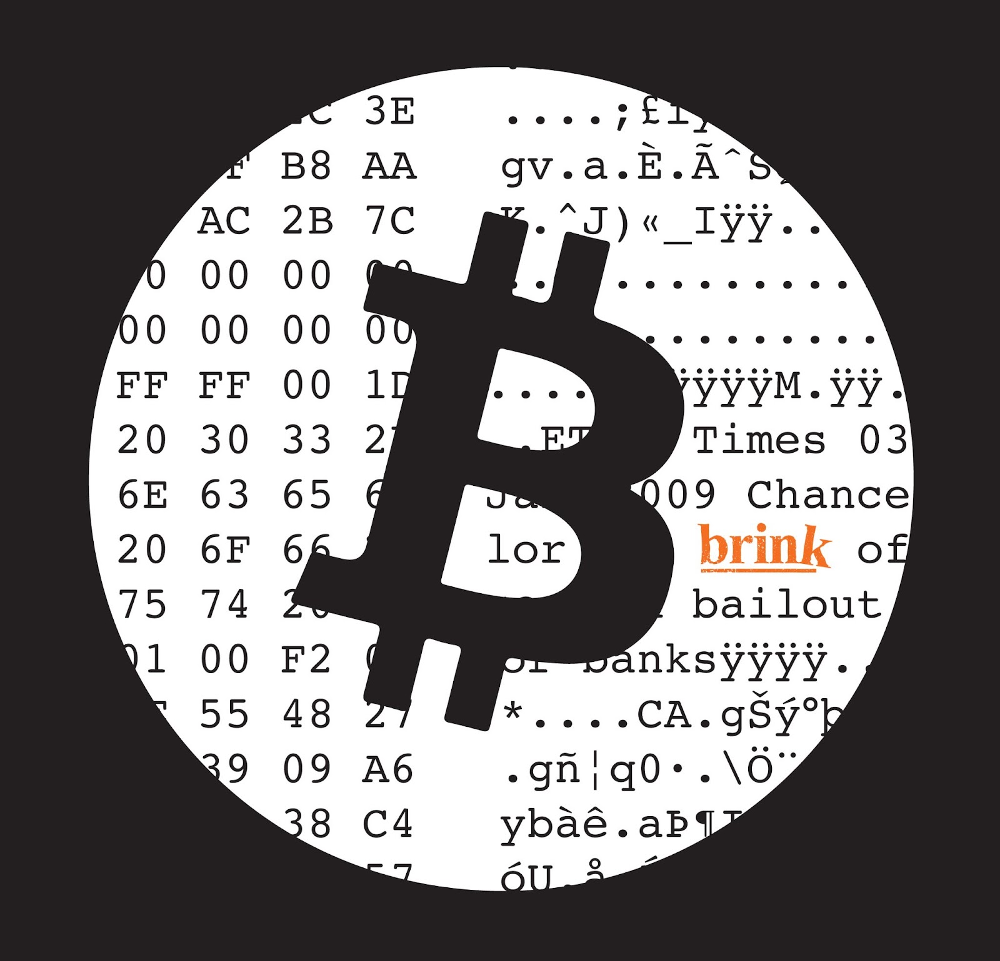
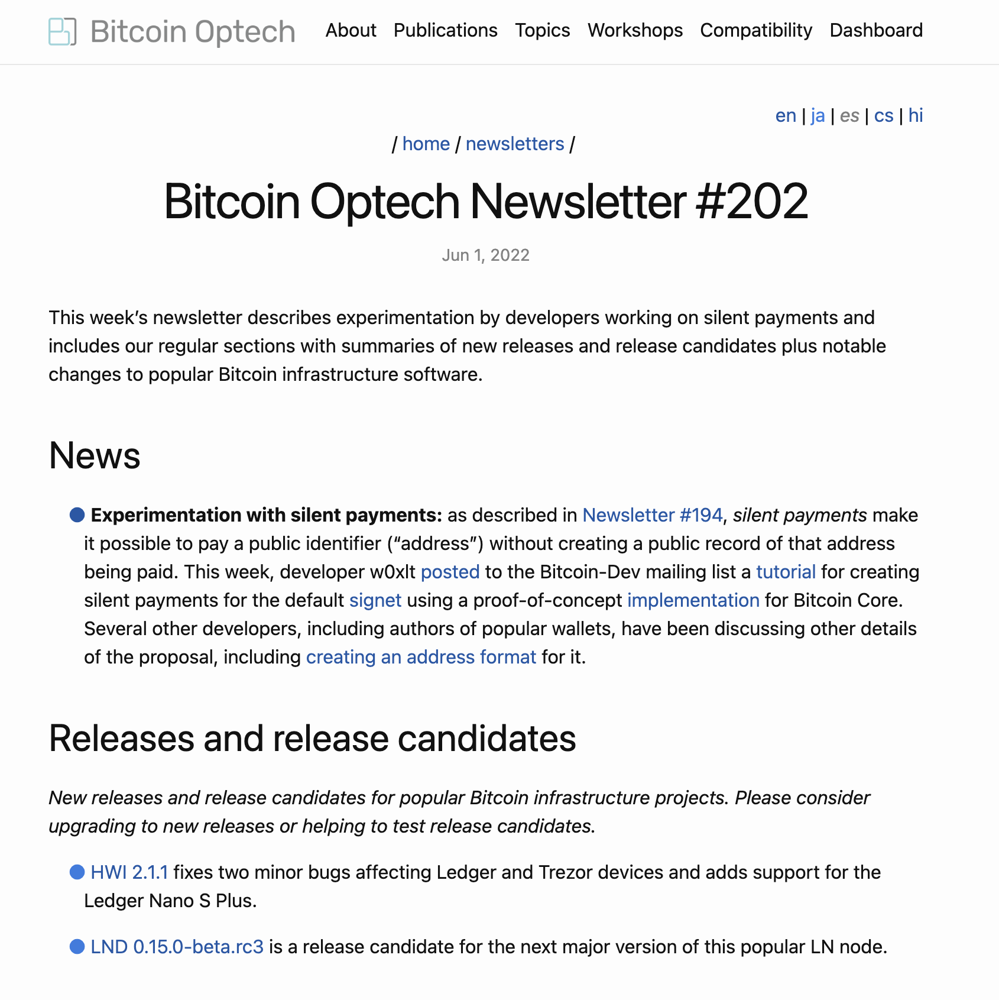

  

    
  

Brink is a 501c3 dedicated to supporting the Bitcoin software, protocol,
and network through developer funding, education, and mentoring. See why John
Pfeffer, Tim Draper, Wences Casares, Coinbase, Okcoin, and others have partnered
with Brink to advance Bitcoin's mission...

Help Brink grow and sustain the developers securing the Bitcoin software.

<a href="mailto:donate@brink.dev"><button>Email us to learn about our 2023 plans</button></a>

  <ul class="media-list">
    

      

        
      

      

        <h2 class="post-title">"Brink Emerges as the Top Funder of Bitcoin Core Development"</h2>
        

          Independent research from BitMex Research and CoinDesk state: "The nonprofit has funded the highest number of active Bitcoin Core developers and reviewers". <a href="https://www.coindesk.com/tech/2022/10/27/brink-emerges-as-the-top-funder-of-bitcoin-core-development-bitmex-research-says/">More...</a>
        

      

    

    

      

        
      

      

        <h2 class="post-title">Brink is funding Bitcoin developers</h2>
        

          <ul style="list-style-type:disc;margin-left:2em;text-align:left">
            <li>Independent developers across 5 countries focused on Bitcoin</li>
            <li>Priority on securing, testing, and review</li>
            <li>Brink office in London for in-person collaboration</li>
            <li>See what our grantees are working on <a href="#current-grantees">below</a></li>
          </ul>
        

      

    

    

      

        
      

      

        <h2 class="post-title">Brink is onboarding new Bitcoin developers</h2>
        

          <ul style="list-style-type:disc;margin-left:2em;text-align:left">
            <li>Brink grantees help run the community's premier educational and technical resource, <a href="https://bitcoinops.org/">Bitcoin Optech</a>. Weekly newsletters, podcasts, wiki, workshops</li>
            <li>Grantees run the weekly <a href="https://bitcoincore.reviews/">Bitcoin PR Review Club</a>, a pipeline for new developers</li>
            <li>Brink grantees mentor junior developers via the Summer of Bitcoin and Qala programs</li>
            <li>Physical London office promotes mentorship</li>
          </ul>
        

      

    

  </ul>

<a href="mailto:donate@brink.dev"><button>Reach out about donating</button></a>

# Current Grantees


  
  

    

      
    

    

      <h3 class="team-name">{{ item.name }}</h3>
      <h4 class="item-title">{{ item.title | upcase }}</h4>
      

        {{ item.description }}
      

    

  

  

<h2>Donate</h2>

Brink is entirely donation supported. Help Bitcoin by making a donation.

<a href="mailto:donate@brink.dev"><button>Reach out about donating</button></a>
